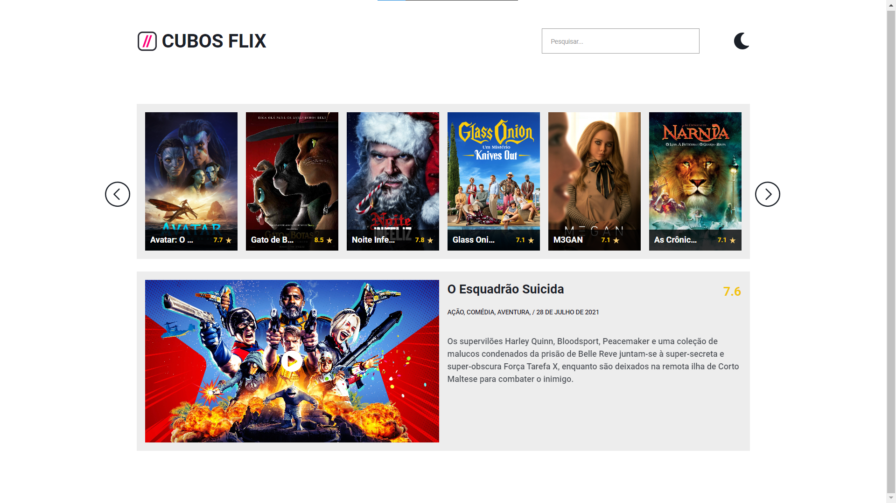

# Cubos flix

Projeto de páginação de filmes consumindo API the movie data base(TMDB)
, construido no módulo 2 da Cubos academy.

## Funcionalidades

- Temas dark e light
- Busca de filmes
- Modal
- Filme em destaque do dia

## Demonstração

## 🔗 Links

`CTRL` + `CLICK` para abrir em nova guia

`Demonstração` https://ronalt4cs.github.io/cubos-flix/

`API link` https://www.themoviedb.org/faq/website

